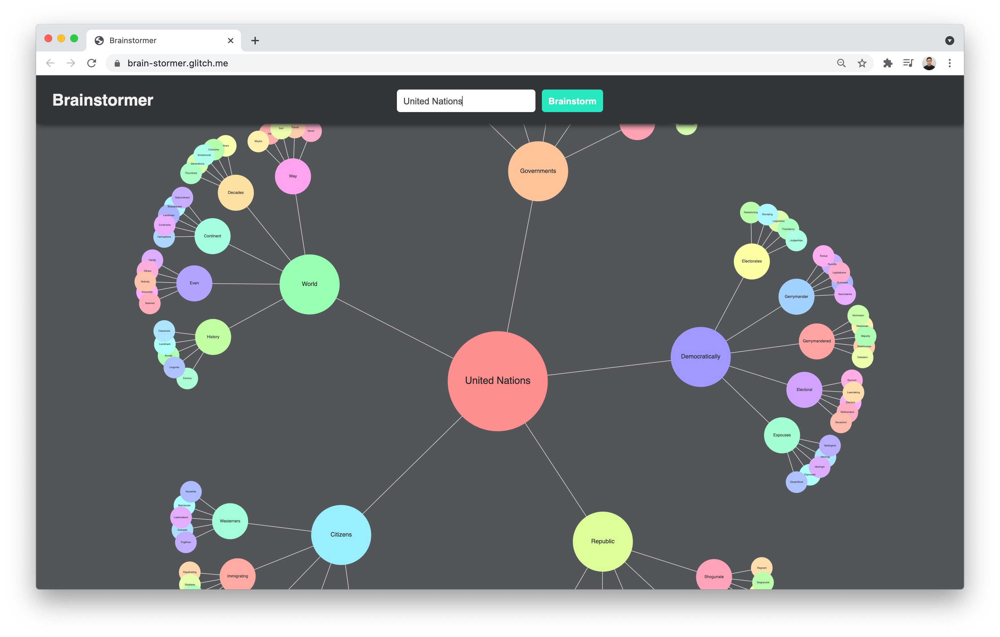

# Brainstormer


## Description
**Brainstormer** is a simple brainstorming web application for quickly exploring various related words given an input word or sentence.

The app uses [D3.js](https://d3js.org/) for visualizing the words in the client side, and it uses Python libraries [spaCy](https://spacy.io/) and [simpleneighbors](https://github.com/aparrish/simpleneighbors) for finding related words in the server side. The words are pulled from [List Of English Words](https://github.com/dwyl/english-words).

Here's the [Live Demo on Glitch](https://brain-stormer.glitch.me/).

## Setup
1. You need to have [Python](https://realpython.com/installing-python/) installed on your computer
2. Run the following commands in the Terminal
```
git clone https://github.com/cuinjune/brainstormer.git
cd brainstormer
python -m http.server 8080
```
3. Open your web browser and navigate to http://localhost:8080

## Source Code
* Client (Javascript): https://github.com/cuinjune/brainstormer
* Flask server (Python): https://github.com/cuinjune/brainstormer-flask

## Author
* [Zack Lee](https://www.cuinjune.com/about): MPS Candidate at [NYU ITP](https://itp.nyu.edu).
